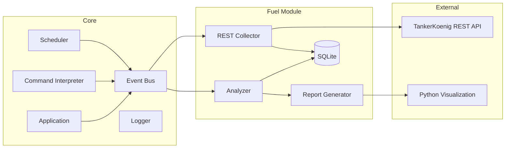
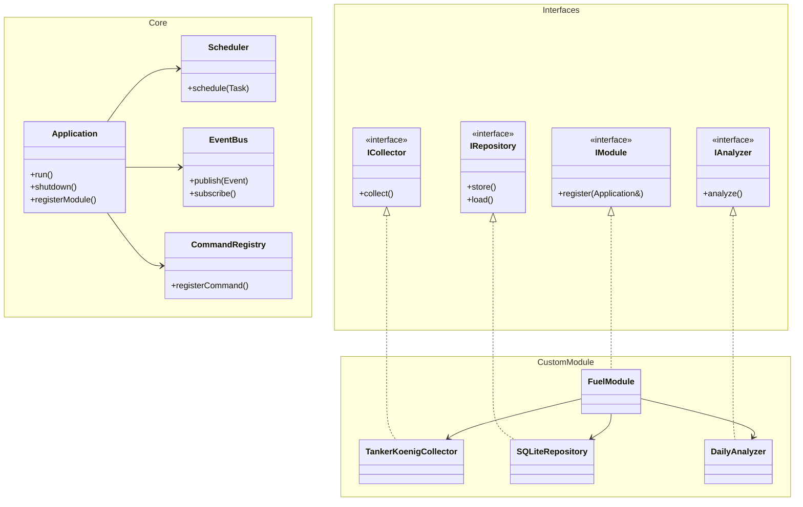
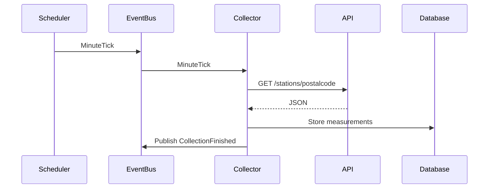
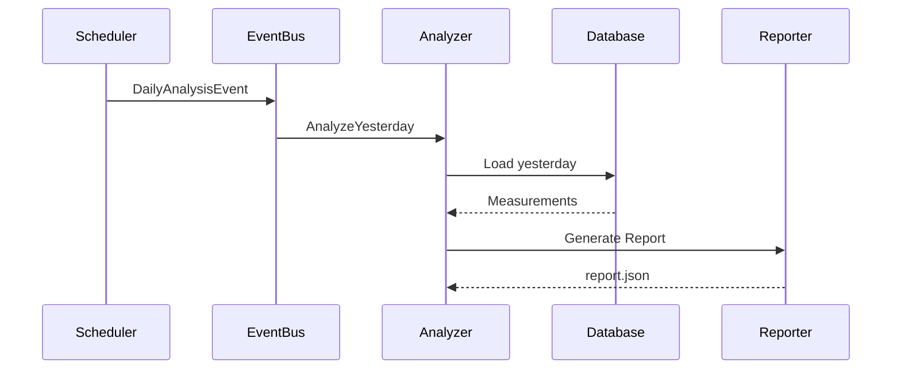
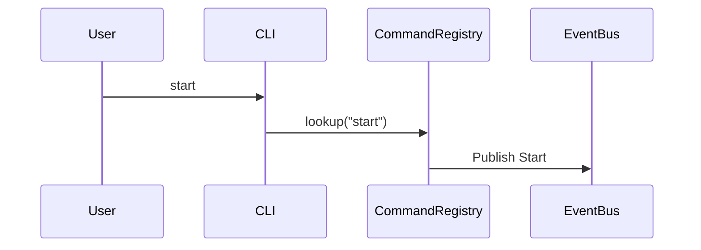

# Architecture

This document is intended to provide an overview of the entire system, its components, and how they communicate with
each other.

## System Overview

A rough overview of the system architecture and how the components are connected with each other. As evident, the
Event Bus is the center of the application. It is responsible to manage the communication between all the other
components.



## System Architecture

The Architecture is designed to split the System into two parts:

1. Independent Core
2. Modular Plugin System

That way, it is easy to make the application track and record a completely different type of data (i.e., stock prices).
This architectural decision is reflected in the class diagram, the core itself is disconnected from everything and
the ```FuelModule``` itself just has to implement the predefined interfaces to make everything work together.



## System Interaction

This diagram shows the workflow of how the system collects a new set of data and saves it into persistent storage.



Here, the process of triggering the analysis event is emitted into the system which subsequently triggers the analysis
to start.



This diagram shows the process of a User entering a command via the CLI which then is processed by the system.


