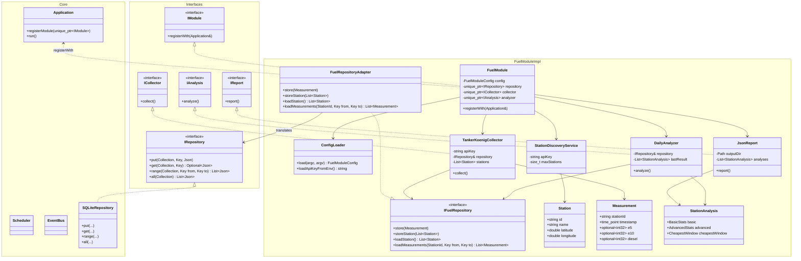
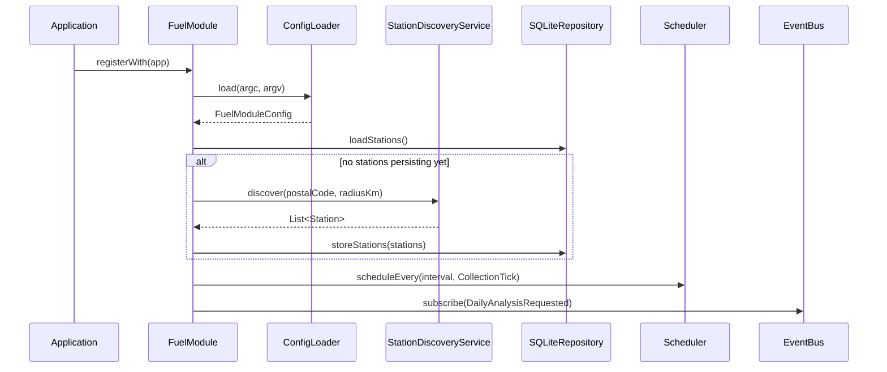
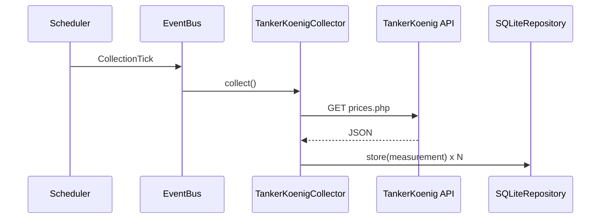
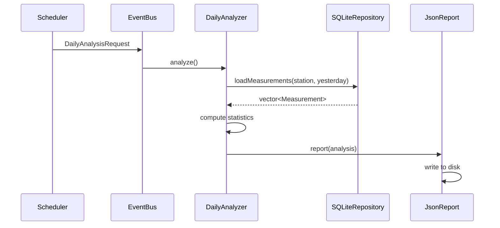

# ```FuelModule```

This document is supposed to detail the architecture and design choices of the ```FuelModule```.

## System Architecture

An overview of the entire ```FuelModule``` and how it connects to the Application itself represented by a class diagram.
The module is designed to implement the provided interface definitions from the core, to ensure generic compatibility.



## Runtime Diagrams

This section is supposed to detail the control flow within a module.

### Startup Sequence

This sequence diagram shows what the module goes through once it was started. It needs to load the configuration, start
scheduling recurring tasks, and subscribe to relevant events.



### Date Request



### Analyzing Flow

This sequence diagram details the flow when the daily analyzing is triggered.


